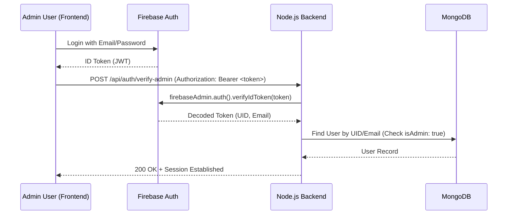
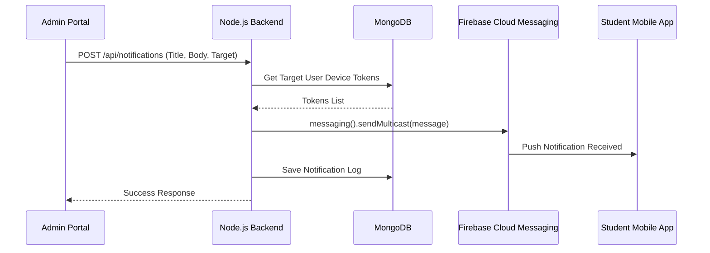
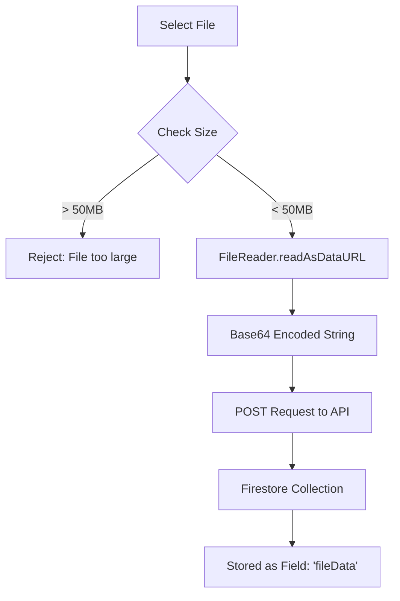
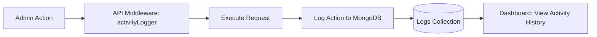

# System Flow Documentation: Student Affair Portal

This document explains the core technical flows of the application, designed for FYP viva preparation.

## 1. Authentication & Authorization Flow

The system uses a hybrid approach: **Firebase Auth** for identity and a **Custom Admin Node.js Backend** for role verification.



## 2. Push Notification Flow (FCM)

Administrators can send notifications to specific users or broadcast to everyone.



## 3. Base64 File Storage Flow (Firestore)

A unique feature of this project is storing files directly in Firestore as Base64 strings, bypassing traditional "Storage Buckets" for university-scale assets.



## 4. Activity Logging Flow

To ensure accountability, every administrative action (Create, Update, Delete) is logged.



## 5. CRUD Operation Flow (Example: Educational Resources)

1. **Frontend**: Admin fills form (Resource name, category, file).
2. **Preprocessing**: File is converted to Base64.
3. **Backend**: Validator checks input schema.
4. **Processing**: `activityLogger` records the "Create Resource" action.
5. **Storage**: Data is saved to the `academic_resources` collection in Firestore.
6. **Confirmation**: Reached user via Toast notification.
7. Firestore Collection Schemas

The following schemas define the data structure for each collection in Firestore:

### `users` Collection

```json
{
  "uid": "string",
  "name": "string",
  "email": "string",
  "degree": "string",
  "semester": "string",
  "gender": "string",
  "profileImageBase64": "string",
  "fcmToken": "string",
  "isProfileCompleted": "boolean",
  "createdAt": "serverTimestamp"
}
```

### `lostNfound` Collection

```json
{
  "title": "string",
  "reportType": "string",
  "description": "string",
  "date": "string",
  "time": "string",
  "imageUrl": "string",
  "isClaimed": "boolean",
  "createdBy": "string",
  "createdAt": "string",
  "claimedBy": "string",
  "claimedAt": "string"
}
```

### `Events` Collection

```json
{
  "title": "string",
  "date": "string",
  "time": "string",
  "location": "string",
  "image": "string",
  "category": "string",
  "createdAt": "string"
}
```

### `academic_resources` Collection

```json
{
  "title": "string",
  "semester": "string",
  "subject": "string",
  "resourceType": "string",
  "fileName": "string",
  "fileType": "string",
  "fileSize": "string",
  "fileBase64": "string",
  "createdAt": "string",
  "updatedAt": "string"
}
```

### `groups` Collection (Group Chat only)

```json
{
  "name": "string",
  "description": "string",
  "coverImage": "string",
  "category": "string",
  "icon": "IconData",
  "iconColor": "Color",
  "createdAt": "serverTimestamp",
  "membersCount": "int"
}
```
