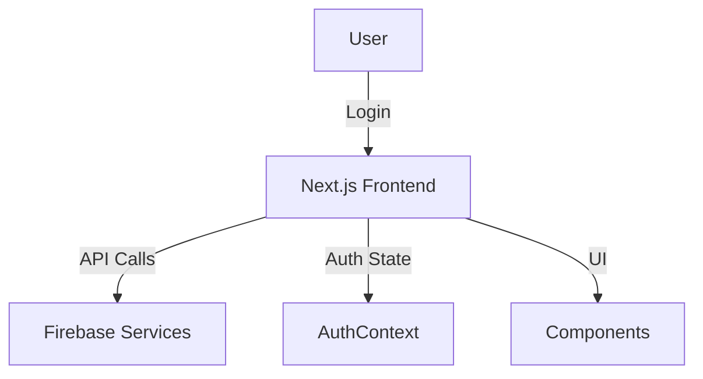

# Project Flow & Main Files Overview

This document provides a high-level overview of the flow of your web application, the main files involved, and the React hooks used throughout the project.

---

## 1. Application Flow

### **Frontend (Next.js + React + Firebase)**
- **Entry Point:**
  - The app starts from `src/app/layout.tsx` and `src/app/page.tsx`.
  - Global providers are set up in `src/app/providers.tsx` (e.g., AuthContext).
- **Routing:**
  - Next.js file-based routing under `src/app/`.
  - Protected routes are under `src/app/(protected)/` (e.g., dashboard, users, logs, notifications, etc.).
  - Public routes like `src/app/login/page.tsx` for authentication.
- **Authentication:**
  - Managed via `src/context/AuthContext.tsx` and `src/utils/firebaseAuth.ts`.
  - Uses Firebase for auth (see `src/config/firebase.ts` and `src/firebaseConfig.js`).
- **API Calls:**
  - Frontend communicates with Firebase and possibly other external APIs using `src/utils/api.ts`.
- **UI Components:**
  - Layout and UI components in `src/components/` (e.g., `Layout/Sidebar.tsx`, `UI/Modal.tsx`).
  - Styling via Tailwind CSS (`src/app/globals.css`, `tailwind.config.js`).

---

## 2. Main Files

### **Main Frontend Files**
- `src/app/layout.tsx` – Main layout for all pages.
- `src/app/page.tsx` – Home page.
- `src/app/providers.tsx` – Context providers (e.g., AuthContext).
- `src/context/AuthContext.tsx` – Authentication context and logic.
- `src/utils/api.ts` – API utility for HTTP requests.
- `src/components/Layout/Sidebar.tsx` – Sidebar navigation.
- `src/components/UI/Modal.tsx` – Modal component.
- `src/config/firebase.ts` & `src/firebaseConfig.js` – Firebase configuration.

---

## 3. React Hooks Used

- **useState** – For local state management in components.
- **useEffect** – For side effects (e.g., fetching data, auth state changes).
- **useContext** – To access AuthContext and other contexts.
- **useRouter** (from Next.js) – For navigation and route protection.
- **Custom Hooks:**
  - Likely in `src/context/AuthContext.tsx` or `src/utils/` for auth and API logic.

---

## 4. Example Flow: User Login
1. User visits `/login` (`src/app/login/page.tsx`).
2. Login form uses Firebase Auth via `src/utils/firebaseAuth.ts`.
3. On success, AuthContext updates user state.
4. User is redirected to a protected route (e.g., `/dashboard`).
5. Protected routes check AuthContext for authentication.
6. Data is fetched from Firebase or external APIs using `src/utils/api.ts`.
7. UI updates with user-specific data.

---

## 5. Summary Diagram

---

This document should help you understand the overall structure, flow, and main files of your web application.
